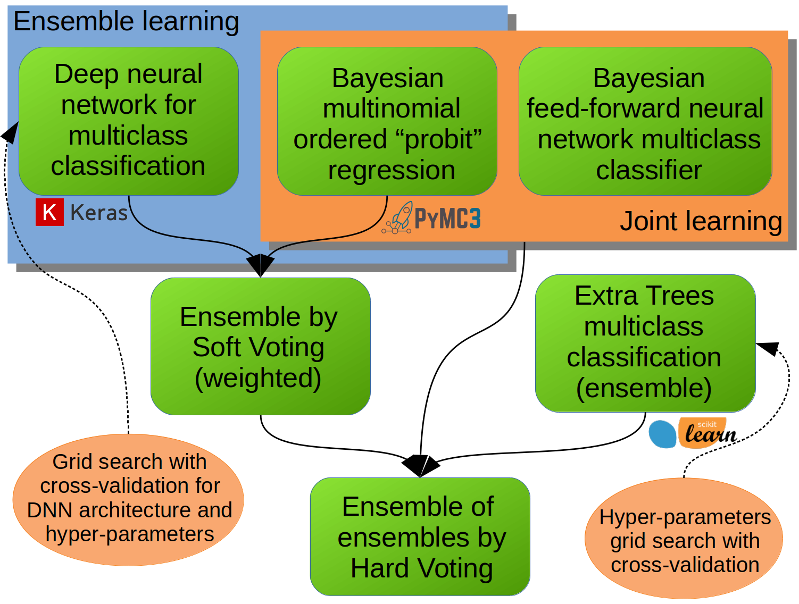

## Bayesian wide and deep model for multiclass classification

Bayesian wide and deep machine learning model, which incorporates joint and ensamble learning, for the multiclass classification.

 

The model is implemented using a combination of the following popular **Python** libraries:
* [Keras:](https://keras.io/) The Python Deep Learning library
* [PyMC3:](http://docs.pymc.io/) Bayesian statistical modeling and Probabilistic Machine Learning
* [Scikit learn:](http://scikit-learn.org/stable/index.html) Machine Learning in Python

Proposed overall model incorporates **joint** and **ensemble** learning, using combination of three different individual machine learning models. Joint learning itself combines **wide and deep** models in the Bayesian setting. The wide model comes from the Bayesian multinomial ordered **probit** regression (which is a multiclass classification model that preserves inherent ordering between categories without imposing distance measure between the categories). The deep model is a Bayesian feed-forward **artifical neural network** (with several hidden layers) and a softmax activation on the output layer, making it appropriate for the multiclass classification (without considering ordering between categories). Both model parts, wide and deep, are constructed in the Bayesian setting and are jointly trained using the **Markov Chain Monte Carlo** (MCMC) algorithm. Ensemble learning combines a Bayesian multinomial ordered probit regression with a **deep neural network** (densly connected multilayer ANN) using the weighted **soft voting** principle. The deep neural network architecture (which is composed of many densely connected, following by, regularizing layers) along with some of its hyper-parameters, is optimised using the **grid search with cross-validation**. The third individual model is itself an ensemble of tree-based machine learning models (i.e. **extra trees classifier**) for the multiclass classification. The hyper-parameters of this model (i.e. ensemble of trees) is optimised using the grid search with cross-validation. The final ensamble of three different groups of models is carried out using the (equal weighted) **hard voting** principle.
